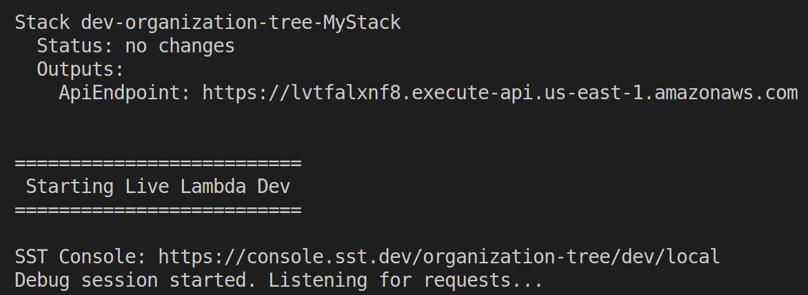
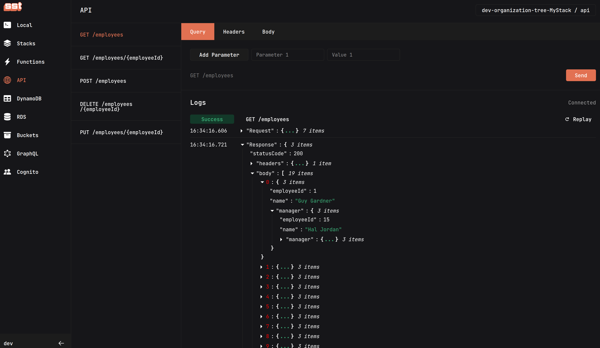
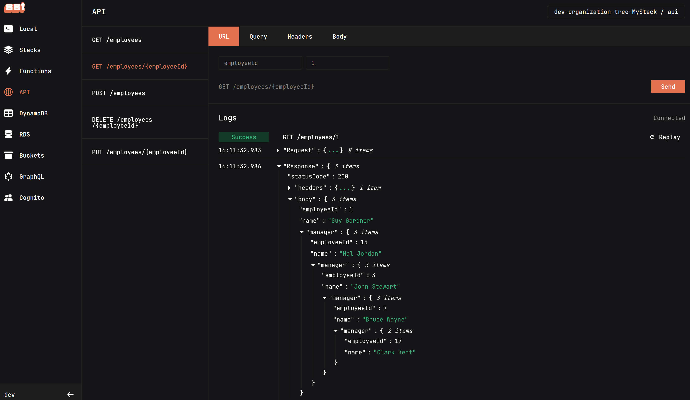
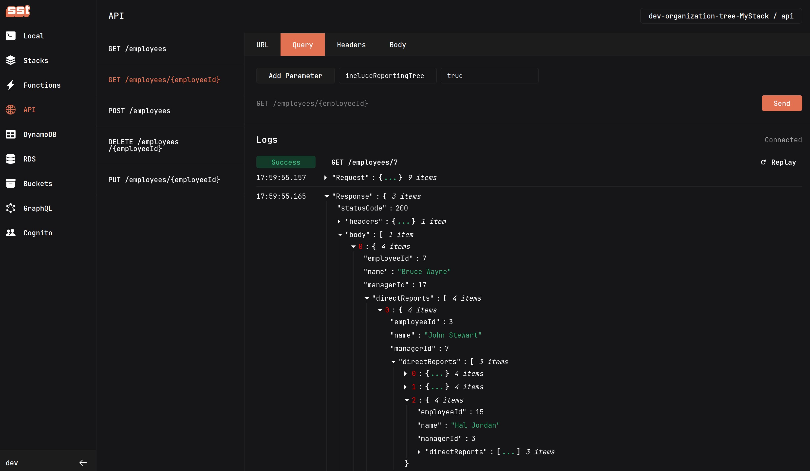
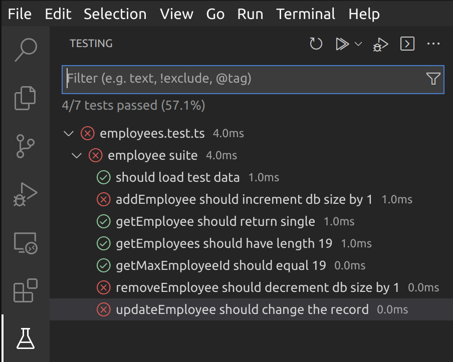

# Overview

This solution uses [SST](https://sst.dev/), a framework built on top of the [AWS CDK](https://aws.amazon.com/cdk/).

## Prerequisites

- [Visual Studio Code](https://code.visualstudio.com/) must be installed (as well as the [Vitest](https://marketplace.visualstudio.com/items?itemName=ZixuanChen.vitest-explorer) extension for unit testing).
- [AWS CLI](https://aws.amazon.com/cli/) must be installed with a [profile configured](https://docs.aws.amazon.com/cli/latest/userguide/cli-configure-quickstart.html) to use it.

## Run Solution

- Clone this repository using the `Code` link at the top of the page.
- Open the cloned repository folder in Visual Studio Code.
- Open a terminal to the root folder of the repository, and execute the following:

```bash
# Install dependencies
npm install

# Start SST
npm start
```

- Follow prompts to configure a stage name (`dev` is used below) or accept the default.
- After deployment, the terminal will show something similar to the following:



- Open [console.sst.dev](https://console.sst.dev).
- Navigate to the `API` tab to observe the defined REST endpoints.
- Confirm that the `GET` endpoints function as expected

> **Warning**
> `DELETE`, `POST`, and `PUT` endpoints are not implemented, so only the organization data provided is currently used.

### GET /employees

Returns all employees (including manager).



### GET /employees/{employeeId}

Returns a single employee for a valid `employeeId` parameter.



### GET /employees/{employeeId}?includingReportingTree=true

Returns a tree of `directReports` for the employee when the `includeReportingTree=true` query parameter is included.



## Run Unit Tests

- Navigate to the `Testing` tab in Visual Studio Code.
- Click `Run Tests`.

> **Warning**
> Test failures shown here indicate unimplemented methods.



## Remove Artifacts

```bash
# Delete all deployed artifacts from AWS
npx sst remove
```
